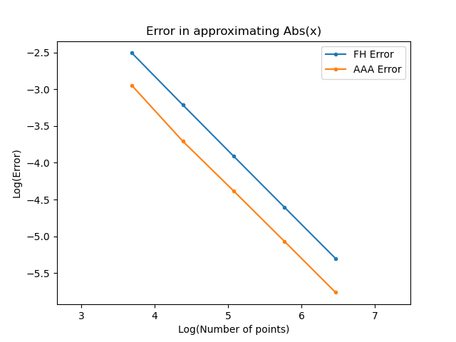

# BaryRational

"You want poles with that?"

This small package contains both one dimensional barycentric rational
approximation, using the AAA algorithm [1], and one dimensional
barycentric rational interpolation with the Floater-Hormann weights
[2]. The derivatives are calculated using the formulas of [3].

The AAA approximation algorithm can model the poles of a function, if
present. The FH interpolation is guaranteed to not contain any poles 
inside of the interpolation interval.

NOTE: Currently, the derivatives are not working.

## Usage

    julia> using BaryRational
    julia> x = [-3.0:0.1:3.0;];
    julia> f = x -> sin(x) + 2exp(x)
    julia> fh = FHInterp(x, f.(x), order=3, grid=true)
    julia> fh(1.23)
    7.78493669233287
    
Note that the default order is 0. The best choice of the order
parameter appears to be dependent on the number of points (see Table 2
of [1]) So for smaller data sets, order=3 or order=4 can be good
choices. This algorithm is not adaptive so you will have to try and see
what works best for you

If you know that the x points are on an even grid, use grid=true

For approximation using aaa:

    julia> a = aaa(x, f.(x))
    julia> a(1.23)
    7.784947874510929
    
and finally the exact result

    julia> f(1.23)
    7.784947874511044

The AAA algorithm is adaptive in the subset of support points that it
chooses to use.

## Examples

Here is an example of fitting f(x) = abs(x) with both FH and AAA. Note
that because the first derivative is discontinuous at x = 0, we can
achieve only linear convergence. (Note that systems like Chebfun and
ApproxFun engineer around this by breaking up the interval at the
points of discontinuity.)  While the convergence order is the same for
both algorithms, we see that the AAA has an error that is about a factor
of 1.6 smaller than the Floater-Hormann scheme.

    using PyPlot
    using BaryRational
    function plt_err_abs_x()
        pts = [40, 80, 160, 320, 640]
        fh_err  = Float64[]
        aaa_err = Float64[]
        order = 3
        for p in pts
            xx = collect(range(-5.0, 5.0, length=2p-1))
            xi = xx[1:2:end]
            xt = xx[2:2:end]
            yy = abs.(xi)
            fa = aaa(xi, yy)
            fh = FHInterp(xi, yy, order=order, grid=true)
            push!(aaa_err, maximum(abs.(fa.(xt) .- abs.(xt))))
            push!(fh_err, maximum(abs.(fh.(xt) .- abs.(xt))))
        end
        plot(log.(pts), log.(fh_err), ".-", label="FH Error")
        plot(log.(pts), log.(aaa_err), ".-", label="AAA Error")
        xlabel("Log(Number of points)")
        ylabel("Log(Error)")
        legend()
        axis("equal")
        title("Error in approximating Abs(x)")
    end
    plt_err_abs_x()

Since both of these can approximate / interpolate on regular as well as irregular grid
points they can be used to create ApproxFun Fun's.  ApproxFun needs to be able to evaluate,
or have evaluated, a function on the Chebyshev points (1st kind here, 2nd kind for Chebfun),
mostly if you have function values on a regular grid you are out of luck.  Instead, use the
AAA approximation algorithm to generate an approximation, use that to generate the values on
the Chebyshev grid, use ApproxFun.transform to transform the function values to coefficients
and then construct the Fun.  The following shows how.

    using ApproxFun
    import BaryRational as br

    # our function
    f(x) = tanh(4x - 1)

    # a regular grid
    xx = [-1.0:0.01:1.0;];

    # and evaluated on a regular grid
    yy = f.(xx);

    # and then approximated with AAA
    faaa = br.aaa(xx, yy);

    # but ApproxFun needs to be evaluated on the Chebyshev points
    n = 129
    pts = chebyshevpoints(n);
    S = Chebyshev();

    # construct the Fun using the aaa approximation on the Chebyshev points
    pn = Fun(S, ApproxFun.transform(S, faaa.(pts)));

    # now compare it to the "native" fun
    x = Fun();
    fapx = tanh(4x - 1);
    println(norm(fapx - pn))

which yields an error norm of 2.955569189697878e-14. Pretty nice.

[1] [The AAA algorithm for rational approximation](http://arxiv.org/abs/1612.00337)

[2] [Barycentric rational interpolation with no poles and high rates of approximation](https://citeseerx.ist.psu.edu/viewdoc/download?doi=10.1.1.475.3902&rep=rep1&type=pdf)

[3] [Some New Aspects of Rational Interpolation](https://www.ams.org/journals/mcom/1986-47-175/S0025-5718-1986-0842136-8/S0025-5718-1986-0842136-8.pdf)
